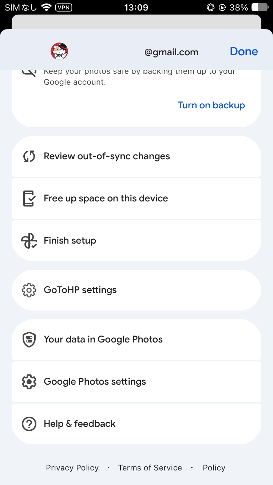
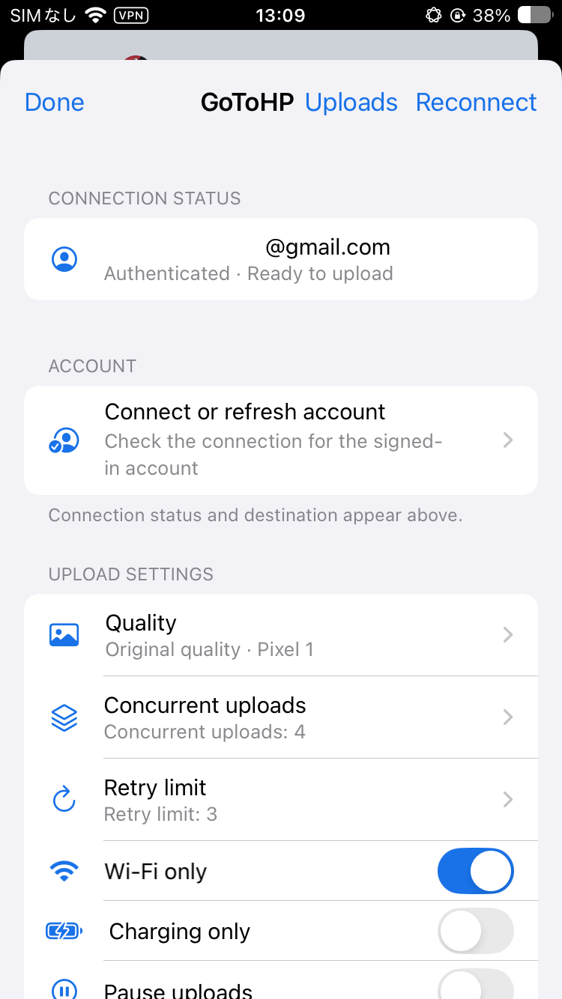
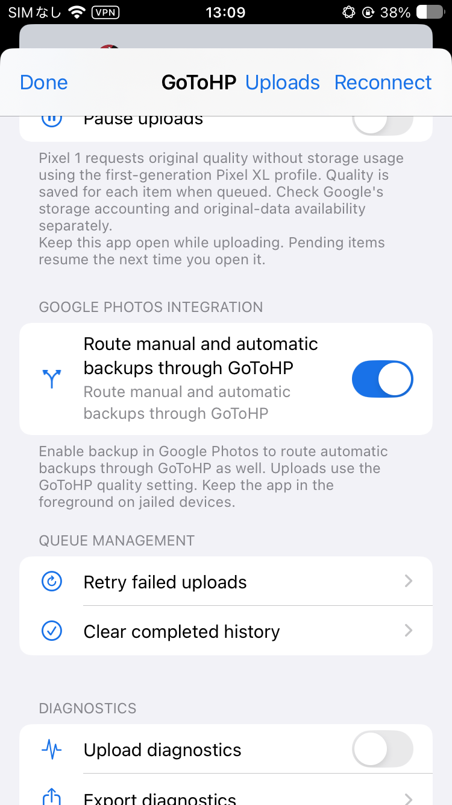

# GoToHP for iOS — Gunshot

[English](README.md) · [日本語](README.ja.md)

Jailbreak・サイドロード・LiveContainer 向けの Google Photos アップローダー。[xob0t/gotohp](https://github.com/xob0t/gotohp) の Go コアを使い、jailbreak 版は独立した daemon、jailed 版は Google Photos 内でアップロードします。

**開発版です。** バージョン番号を固定せず、各機能が必要とするクラス・メソッド・引数の型を調べて、旧版・新版のAPIを**機能ごとに自動選択**します。添付IPAで解析確認した基準バージョンは **7.20.2（iOS 16.1以降）** と **7.92.0（iOS 18.0以降）**です。他の版もAPIが一致すれば有効になりますが、実機検証済みという意味ではありません。[バージョン互換性の解析](docs/analysis/google-photos-7.20.2.md)。

## スクリーンショット

<p>
  
  
</p>
<p>
  
  
  
</p>

## 免責事項 / Disclaimer

Google・Apple とは無関係の非公式プロジェクトです。**現状のまま、無保証で提供**します。非公式 API やアプリ更新により動作しなくなるほか、アカウント制限・データ損失・容量料金が発生する可能性があります。元の写真・動画は別途バックアップしてください。Google Photos のバイナリ・署名証明書・認証情報は配布しません。

## インストールと使い方

> [!IMPORTANT]
> **Google アカウントへのログイン前に tweak を導入・有効化してください。** サイドロードでは、最初から **GunshotJailed** を注入した IPA を使います。互換性のある Google Photos の SSO 内で再署名後の識別子と共有 Keychain の権限不足を自動補正するため、別途 Sideload Spoofer は不要です。ログイン成功の実機検証は未完了です。[導入ガイド](docs/jailed.md#sideloadly)。
>
> 1. jailbreak では tweak を導入・有効化し、サイドロードでは **GunshotJailed** 注入済みの Google Photos IPA をインストールします。LiveContainer では起動前に dylib を取り込み、Google Photos の guest で有効化します。
> 2. tweak を有効にした状態で **Google Photos を起動**し、Google アカウントへログインします。既存環境を更新するときは、**同じ署名アカウント・Bundle ID・アプリデータ**、LiveContainer では**同じ guest／データコンテナ**を維持してください。
> 3. ログイン情報の準備ができると GoToHP が自動接続します。画質などの変更や失敗時の「再接続」は、**プロフィールメニュー → GoToHP の設定**から行えます。
>
> ログイン済みアプリ・guest の削除や、新しいデータコンテナの作成は避けてください。App Store 版から別署名のアプリへ移す場合など、ログイン状態の維持は保証されません。[詳しい導入手順](docs/jailed.md)。

### サイドロード / LiveContainer

[GitHub Actions](https://github.com/tqmane/gunshot/actions) の `gotohp-tweak-jailed` に `.deb`、`GunshotJailed.dylib`、notices を同梱しています。[導入ガイド](docs/jailed.md)に従い、パッケージを注入するか LiveContainer に dylib を取り込みます。

Google Photosの起動時にログイン中アカウントへ自動接続します。GoToHP設定を開く必要はありません。**アップロード → 写真・動画を選択**からアップロードできます。**Google Photos は前面で開いたままにしてください。** jailed 版はアプリを閉じると送信を継続できません。

jailed / 純正APIに互換性のあるGoogle Photosの**手動・自動バックアップを GoToHP へ送る**は既定 OFF です。有効にして送信先を確認すると、GoToHP を開かずに対応するバックアップ操作を転送します。自動バックアップには Google Photos 側のバックアップも ON にしてください。[対応経路](docs/analysis/backup-routing.md)と[未対応の範囲](docs/native-routing.md)。

### Jailbreak

**クラッシュする場合は、ChoicyでGoogle PhotosのGunshotだけを有効にしてください。**

GitHub Actions の `gotohp-tweak-rootless` または `gotohp-tweak-rootful` の `.deb` をパッケージマネージャーで導入します。libSandy 1.1.6 以降（[opa334 のリポジトリ](https://opa334.github.io/)）、substrate 互換の注入環境が必要です。依存パッケージも解決できるパッケージマネージャーで導入してください。GoToHP daemon への接続だけを許可する libSandy プロファイルは同梱し、libSandy 本体は共有のシステム依存パッケージとして導入します。

**Google Photosを起動**すると、ログイン中アカウントへ自動接続します。トークンの貼り付けやGoToHP設定を開く操作は不要です。画質などの変更や失敗時の「再接続」は、**プロフィールメニュー → GoToHP の設定**から行えます。jailbreak版もiOSの「設定」には項目を追加せず、PreferenceLoaderも不要です。この設定画面、Apple PhotosのGoToHPボタン、対応する共有シートの **Upload with GoToHP** からアップロードできます。

jailbreak版も、7.20.2を含む対応APIで**手動・自動バックアップを GoToHP へ送る**を利用できます。最初にGoToHP設定で有効化して送信先を確認すれば、純正ボタンから画面を開かずキューへ送ります。自動送信にはGoogle Photos本体のバックアップもオンにしてください。アップロード完了後は、設定画面を開いたり再起動したりせず、純正のサーバー同期で表示更新を要求します。[転送と完了処理の詳細](docs/analysis/backup-routing.md)。

キューへの受け渡し完了まではGoogle Photosを開いてください。その後は、daemon内の認証が利用できる間、アプリを閉じても送信を続けます。認証の更新はGoogle Photos自身が行い、daemonでのトークン保持は最大5分です。認証がなくなった場合やdaemon再起動後は、Google Photosを開いて認証が更新されるまで、再試行回数を消費せず待機します。アプリ終了中に認証を無期限で更新できる仕組みではありません。[認証の詳細](docs/analysis/native-account.md)。

## 画質とキュー

大量に取り込む場合は、**GoToHP の設定 → アップロード → アルバムを選択**を使ってください。フォルダ内のアルバムもたどれ、アクセス可能な写真・動画をまとめて追加できます。**写真と動画を選択**は1回100件までです。写真選択画面に **Unable to Load Items** が出た場合は、キャンセルしてアルバム経由で取り込んでください。

原本は1件ずつ準備します。準備中はアプリを開いたままにしてください。**準備を停止**は処理中の1件が終わると停止し、追加済みのキューは保持します。読めない写真は失敗件数に数え、残りの取り込みを続けます。再試行前に写真へのアクセス権とiCloud上の原本を確認してください。[大量取込とHEICの診断](docs/bulk-import.md)。

| 設定 | デバイスプロファイル / リクエストする動作 |
| --- | --- |
| オリジナル | Pixel XL（Pixel 1）、オリジナル画質・容量不使用 |
| 容量節約 | Pixel 2、容量節約画質 |
| アカウントの保存容量を使用 | Pixel 8、オリジナル画質・通常の容量を使用 |

リクエストする動作であり、結果の保証ではありません。元データの取得可否と Google 側の容量使用量は別途確認してください。アップロード成功だけでは容量の扱いは判断できません。アカウント・画質はキュー追加時に固定され、設定変更は既存の項目に影響しません。

PhotoKit の元データを再エンコードせず使い、Live Photo は写真と動画のペアを送信します。キューは進捗表示・再試行・キャンセル・再起動後の復旧に対応。再試行はファイルの先頭からです。確定処理の中断で結果が不明な場合は手動確認・再試行が必要で、重複する可能性があります。キャンセルしても Google Photos に保存済みの写真・動画は削除しません。

## 表示言語

日本語・英語に対応。**GoToHP の設定 → 表示 → 表示言語**で選べます。未対応の端末言語では英語を使い、翻訳ファイルの追加注入は不要です。[翻訳の追加方法](docs/localization.md)。

## ビルド

macOS、Xcode command line tools、Go 1.26.0、Theos、`ldid`、`dpkg` が必要です。

```sh
git clone --recurse-submodules https://github.com/tqmane/gunshot.git
cd gunshot
export THEOS="$HOME/theos"
bash scripts/package.sh jailed  # または rootless / rootful
```

ローカルでの確認:

```sh
python3 scripts/localization.py --check
python3 scripts/prepare-core.py
go test -race -tags cli ./...
go test -tags cli app/backend
go vet -tags cli ./...
```

CI でテストと 3 方式のビルドを行い、`v*` タグの成功時に Release へ配布物を添付します。upstream の更新は `bash scripts/sync-upstream.sh [commit]`。配布時は upstream のライセンスと生成された notices を同梱してください。

Release が作成済みなら、タイトル・説明を保ったまま配布物をアップロードし、同名ファイルを更新します。既存タグ（例: `v0.2.1`）の公開をやり直す場合は、**Actions → Build and test → Run workflow** で `main` を選び、**release_tag** にタグ名を入力してください。更新済みの workflow でそのタグのソースをビルド・テストして公開します。タグは移動しません。**release_tag** が空ならビルドのみです。古い失敗ジョブの再実行には古い workflow が使われるため、この復旧には **Run workflow** を使ってください。

## ライセンス

Gunshot は [GNU GPL v3.0 以降](LICENSE)で提供します。
Copyright (C) 2026 tqmane.

同梱する [gotohp upstream](GotohpCore/upstream/LICENSE) は引き続き MIT ライセンスです
（Copyright (c) 2024 xob0t）。その他の依存関係にもそれぞれのライセンスが適用されます。
配布パッケージの `ThirdPartyNotices.txt` にこれらの表示を同梱します。

## 開発資料

- [構成・認証情報・upstream 連携](docs/architecture.md)
- [Google Photos 解析](docs/analysis/index.md)（日本語）
- [実機チェック](docs/device-validation.md)
